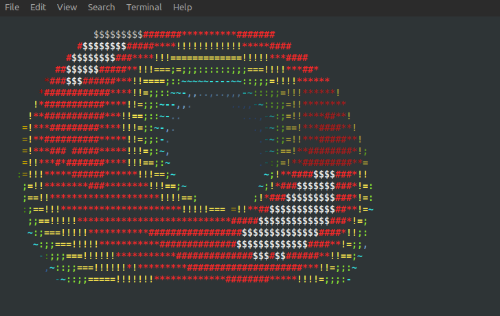

# Ada Spinning Donut

A spinning ASCII torus rendered in the terminal, written in Ada. 



## How it works

The donut is a torus (a circle swept around a central axis). For each frame:

1. **Parameterise** - every surface point is described by two angles: `θ` (around the tube) and `φ` (around the torus center).
2. **Rotate** - the torus is spun simultaneously around the X-axis (angle `A`) and the Z-axis (angle `B`), both advancing every frame.
3. **Project** - points are perspective-projected onto the 2-D screen with a z-buffer to handle occlusion correctly.
4. **Shade** - the surface normal at each point is dotted against a fixed light direction to produce a luminance value, which selects a character from `.,-~:;=!*#$@` (darkest -> brightest).
5. **Colour** - luminance levels are mapped to an ANSI colour gradient: dim blue -> cyan -> green -> yellow -> red -> bright white.

## Build & run

Requires GNAT
```bash
gnatmake -O2 donut.adb
./donut
```

Press **Ctrl+C** to exit. The terminal cursor and colours are restored automatically.

